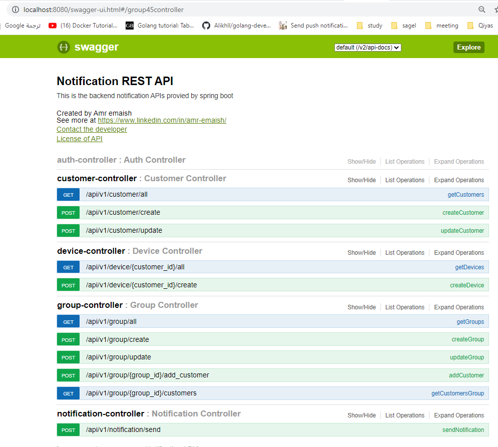
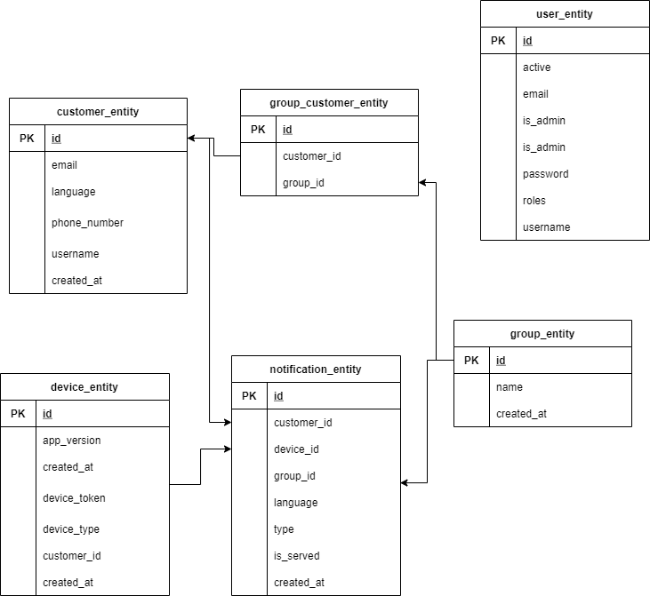

# NotificationService
Notification service based on Spring boot

Features
--------
* Use dynamic templates to send notifications / SMS
* Dynamic languages (you can use whatever language)
* Send notification / SMS to group of people
* Ready to work with SMS or push notification provider

Technologies Used
-----------------

* Springboot

* RabbitMQ as a message broker

* docker-compose for containerization
  
* Tomcat Server

* Swagger — UI for API documentation

* Postgres database

* SpringBoot Unit test

API Documentation
-----------------

Postman Collection => [Download Collection](https://www.getpostman.com/collections/c57d150c992e649da1ff) 

Swagger => http://localhost:8080/swagger-ui.html




DB Schema
-----------------



How to send a notification
-----------------
* first you need to create a customer POST /api/v1/customer/create
 
    ```json
   {
      "email":"amr.emaish@gmail.com",
      "language":"en",
      "phone_number":"123456789",
      "username":"Amr Emaish"
  }
    ```
* second you need to create a device for customer POST /api/v1/device/{customerID}/create
  - deviceType will be iOS or Android

    ```json
    {
      "deviceType" : "iOS",
      "deviceToken" : "472b07b9fcf2c2451e8781e944bf5f77cd8457c8",
      "appVersion" : "15"
    }
    ```    
* third now you can send your message POST /api/v1/notification/send
  - you should remove groud_id in case of you wan to send only for one customer

    ```json
     {
        "groud_id": 1,
        "customer_id": 3,
        "type":"sms",
        "templates": {
          "en": "Hi %username% Your bus is about to reach his destination prepare yourself",
          "ar": "اهلا %username% الباص الخاص بك سوف يصل الى وجهته جهز نفسك "
        },
        "params": {
          "username_ar": "عمرو",
          "username_en": "Amr"
        }
    }
    ```  
Installation
------------

    docker-compose up --build

Testing
-------
    mvn test
    
